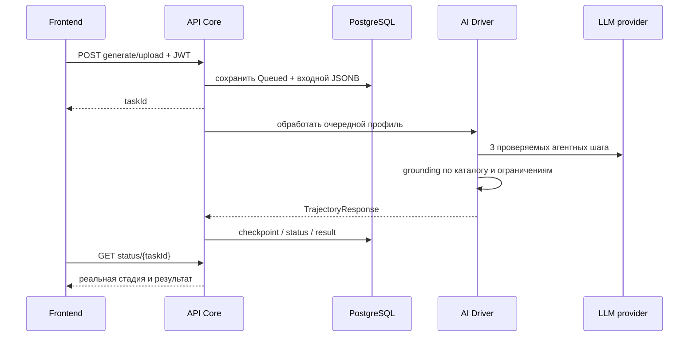

# Руководство разработчика платформы ИОТ

Документ описывает устройство проекта, локальную разработку, контракты, тесты и правила безопасного изменения системы. Бизнес-цель проекта — индивидуальные траектории обучения; код не должен превращать платформу в универсальный анализатор анкет или добавлять неподтверждённые данные.

## 1. Технологии и поток данных

- `frontend`: React 19, Vite 8, nginx, Recharts, ExcelJS, jsPDF.
- `api-core`: ASP.NET Core 9, EF Core, PostgreSQL, JWT, стойкая очередь.
- `ai-driver`: Python 3.13, FastAPI, Pydantic, OpenAI-compatible clients.
- `local-llm`: опциональный Docker profile `local-ai`, llama.cpp server и совместимая GGUF-модель.



API — единственный доверенный вход из frontend. Браузер не обращается напрямую к AI Driver или модели. В production nginx проксирует `/api/v1`; на Vite dev server клиент использует `http://127.0.0.1:5050/api/v1`.

## 2. Структура

```text
frontend/src/
  App.jsx                 маршрутизация, session и действия отчёта
  api.js                  JWT API client, errors, offline dev adapter
  components/             страницы, конструктор, аналитика, roadmap
  reportExport.js         PDF/XLSX/JSON
  *ViewModel*.js          чистая нормализация backend-контрактов

api-core/ApiCore/ApiCore/
  Controllers/            auth, user, analysis, operations
  Services/               queue worker, parsing, validation, PII
  Models/                 EF entities, requests и responses
  Migrations/             ProductionBaseline, processing checkpoint

ai-driver/
  main.py / routes.py     FastAPI surface
  backend/                agent clients, manager, validators, data
  schemas/                Pydantic contracts
  tests/                  unit и OpenAPI contract tests

scripts/                  runtime, ACL, load, backup/restore smoke
```

## 3. Локальный старт

Самый воспроизводимый базовый режим — Docker stack без нейросети:

```bash
./deploy.sh
docker compose ps
```

Он запускает frontend, API Core, PostgreSQL и AI Driver. Локальный провайдер включается через `ENABLE_LOCAL_LLM=true`: `managed` запускает profile `local-ai`, `external` использует готовый OpenAI-compatible endpoint без пятого контейнера.

Единственная рекомендуемая production-точка входа — `deploy.sh` / `deploy.bat`: они создают конфигурацию, валидируют Compose и дожидаются healthchecks. Прямой `docker compose up` предназначен для разработки/диагностики и требует уже готовый `.env`.

### Frontend отдельно

Нужен Node.js 20. API Core должен слушать `127.0.0.1:5050`.

```bash
cd frontend
npm ci
npm run dev
```

Откройте `http://localhost:5173`. Для нестандартного API передайте build-time `VITE_API_URL`. `VITE_OFFLINE_MODE=true` разрешён только для разработки UI: данные находятся в `localStorage`, а результат не доказывает работу backend/LLM.

### API Core отдельно

Нужны .NET SDK 9, PostgreSQL и доступный AI Driver. Удобнее оставить зависимости в Compose и запускать API из IDE с эквивалентными переменными `ConnectionStrings__DefaultConnection`, `JwtSettings__*` и `AiDriver__Url`.

Если нужен только Docker-backend без frontend, после создания `.env` запустите:

```bash
docker compose up -d postgres ai-driver api-core
curl -fsS http://127.0.0.1:5050/health/ready
```

Compose дождётся healthy-состояния PostgreSQL и AI Driver перед API. При запуске API из IDE Data Protection keys хранятся в локальной игнорируемой `.dataprotection-keys/`; путь можно задать через `DataProtection__KeysPath`.

```bash
cd api-core/ApiCore
dotnet restore
dotnet build -c Release
dotnet run --project ApiCore/ApiCore.csproj
```

### AI Driver отдельно

Нужен Python 3.13. OpenAI-compatible endpoint не требуется для старта AI Driver: `/health` и `/models/availability` работают в режиме `no-ai`; вызовы генерации доступны только после подключения провайдера.

```bash
cd ai-driver
python3 -m venv .venv
source .venv/bin/activate
pip install -r requirements.txt
uvicorn main:app --host 127.0.0.1 --port 8000 --reload
```

Не коммитьте `.venv`, `.env`, модели, runtime outputs и пользовательские выгрузки.

## 4. Основные API-контракты

Публичны только регистрация и вход: `POST /api/v1/auth/register`, `POST /api/v1/auth/login`. Остальные пользовательские endpoints требуют Bearer JWT.

Основной API:

- `POST /api/v1/analysis/generate-trajectory` — ручные профили;
- `POST /api/v1/analysis/upload` — файлы и выбранная модель;
- `GET /api/v1/analysis/status/{taskId}` — статус, стадия, прогресс, результат;
- `GET /api/v1/analysis/history` — отчёты текущего пользователя;
- `PUT /api/v1/analysis/rename/{taskId}`;
- `PUT /api/v1/analysis/archive/{taskId}` и `unarchive/{taskId}`;
- `GET /api/v1/analysis/catalog`, `models`, `benchmarks`;
- `GET /api/v1/analysis/users` — только `Admin`;
- `GET /api/v1/operations/metrics` — только `Admin`;
- `GET/PUT /api/v1/user/settings`, `GET /api/v1/user/me`.

AI Driver endpoints находятся под `/agents`: отдельные вызовы DeepSeek, GigaChat и `local_llm`, а также `catalog`, `benchmarks` и `progress/{request_id}`. Старый маршрут Qwen сохранён как deprecated alias. Эти endpoints являются внутренним контрактом API Core, а не браузерным API.

Перед созданием задачи API Core проверяет `/models/availability`. Если провайдер не готов, возвращается `503` с кодом `MODEL_UNAVAILABLE`; задача не записывается в очередь. Отсутствие всех моделей не влияет на readiness API, пока доступны PostgreSQL и AI Driver.

Каждый запрос frontend получает `X-Correlation-ID`. Сохраняйте его при добавлении новых сетевых вызовов и не включайте персональные данные в идентификатор или логи.

## 5. Очередь и статусы

`AnalysisReport` одновременно является записью жизненного цикла задачи. Вход сохраняется до постановки в очередь. Worker блокирует работу транзакционно, обрабатывает не более одного локального задания одновременно и сохраняет checkpoint после каждого профиля.

Допустимые состояния:

- `Queued`;
- `Processing`;
- `Retrying`;
- `Completed`;
- `CompletedWithLimitations`;
- `Failed`.

Не добавляйте клиентский псевдопрогресс. UI должен показывать stage и процент, полученные от API. При перезапуске продолжается только незавершённая часть пакета. Резервная траектория всегда маркируется `CompletedWithLimitations`; не снимайте блокировку экспорта без отдельного утверждённого workflow экспертной проверки.

## 6. Инварианты ИИ-конвейера

1. Курс обязан существовать в `courses_catalog.json`.
2. Пройденные курсы исключаются до выдачи результата.
3. Названия, аннотации, часы, компетенции и результаты обучения берутся из каталога, а не сочиняются моделью.
4. Фиктивные уровни компетенций, проценты коллег, сроки и приоритеты запрещены.
5. Точная когорта — `должность + ИОГВ`; fallback по должности обязан сообщить limitation.
6. Когортное ранжирование отключено при пустом `MIN_COHORT_SIZE`.
7. Перед облачным LLM и external local endpoint ФИО псевдонимизируется, остальные PII маскируются парсером; только managed llama.cpp считается внутренним доверенным runtime.
8. Ошибка LLM не должна выдавать fallback за полноценный AI-результат.
9. Пакет содержит не более 15 профилей; эталонный Qwen profile использует `LOCAL_LLM_PARALLEL=1`.

При изменении prompt/schema одновременно обновляйте Pydantic и C# DTO, contract tests, нормализатор frontend и документацию. Валидируйте реальный ответ модели, а не только fixture.

## 7. Frontend-инварианты

- Production работает с реальным API; offline режим выключен.
- Все searchable dropdown используют единый компонент и ширину своей колонки.
- Повторный выбор должности обязан обновлять аналитические данные и графики.
- Loading, empty, error, disabled и success состояния должны быть различимы.
- Доступность: keyboard focus, semantic labels, `aria-*`, контраст и состояние не только цветом.
- На ширине 390 px горизонтальная прокрутка страницы недопустима; табличные данные переходят в читаемые карточки.
- View model не подставляет демонстрационные значения в отсутствующие поля backend.
- Экспорт должен соответствовать открытому отчёту и создавать непустой blob с корректным расширением.

## 8. Тесты перед commit

### Frontend

```bash
cd frontend
npm ci
npm test
npm run lint
npm run build
```

Предупреждение Vite о существующих chunks более 500 kB является performance risk, но не ошибкой сборки. Новое заметное увеличение bundle нужно обосновать.

### AI Driver

```bash
cd ai-driver
python -m unittest discover -s tests -v
```

Тесты покрывают клиент модели, grounding/валидацию менеджера и OpenAPI-контракт.

### API Core

```bash
cd api-core/ApiCore
dotnet build ApiCore.sln -c Release
dotnet run --project ApiCore.ContractTests/ApiCore.ContractTests.csproj -c Release
```

### Runtime-проверки

Запускайте из корня при healthy stack:

```bash
./scripts/iot_runtime_smoke.sh
./scripts/no_ai_runtime_smoke.sh
./scripts/iot_multi_user_runtime_smoke.sh
./scripts/qa_acl_smoke.sh
./scripts/platform_runtime_smoke.sh
PROFILE_COUNT=15 ./scripts/iot_large_runtime_smoke.sh
./scripts/backup_restore_smoke.sh
python3 scripts/api_read_load_probe.py --requests 300 --concurrency 12
```

Скрипты создают временные учётные записи и отчёты. Сначала прочитайте их заголовок и переменные; не запускайте runtime/load checks против чужой production-среды без окна и разрешения.

## 9. Изменение БД

Модель и migration должны попадать в один commit. Из каталога `api-core/ApiCore`:

```bash
dotnet ef migrations add MeaningfulMigrationName --project ApiCore/ApiCore.csproj
dotnet build ApiCore.sln -c Release
```

Проверьте upgrade на копии production schema и backup→restore. Не редактируйте уже применённую migration задним числом; создавайте следующую. API применяет migrations при старте, поэтому несовместимые изменения требуют плана rolling/maintenance deployment.

## 10. Workflow изменения

1. Воспроизведите проблему и зафиксируйте ожидаемое поведение.
2. Проверьте текущий контракт и данные; не выводите требование из похожего проекта без подтверждения здесь.
3. Сделайте минимальное изменение, сохраняя цель ИОТ.
4. Добавьте регрессионный тест на найденный случай.
5. Выполните тесты затронутого сервиса и релевантный runtime smoke.
6. Проверьте desktop/tablet/mobile и клавиатуру при UI-изменении.
7. Обновите README/руководства, env template и OpenAPI при изменении поведения.
8. Просмотрите diff на секреты, PII, runtime outputs и случайные generated files.

## 11. Definition of done

- код собирается без ошибок;
- unit/contract tests пройдены;
- реальный сценарий с выбранным провайдером пройден;
- данные пользователя изолированы ACL;
- отсутствующие данные не заменяются моками;
- ошибки и ограничения видны пользователю;
- migrations и rollback/backup учтены;
- документация совпадает с кодом и Compose;
- production secrets и модель не попали в Git.

Полная операционная приёмка находится в [RELEASE_GATE.md](RELEASE_GATE.md), архитектурные правила агента — в [agent.md](agent.md), подтверждённый runtime Qwen — в [QWEN3_PIPELINE_VALIDATION_REPORT.md](QWEN3_PIPELINE_VALIDATION_REPORT.md).
