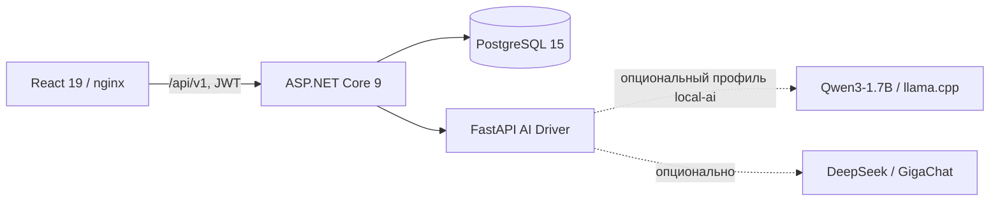

# ИИ-агент индивидуальной траектории обучения (ИОТ)

Production-oriented платформа Корпоративного университета Санкт-Петербурга для формирования индивидуальных образовательных траекторий государственных гражданских служащих. Система использует профиль сотрудника, должность, ИОГВ, цель развития, историю обучения и официальный каталог программ 2025 года. Рекомендации не подменяют решение методиста: результат с ограничениями явно маркируется и требует экспертной проверки.

## Быстрый запуск

Требования: Docker Engine 24+ и Docker Compose v2 (поддерживается также standalone `docker-compose`). Базовый режим без нейросети требует 4–8 ГБ RAM; для опциональной локальной Qwen рекомендуется 16 ГБ RAM и 20 ГБ свободного места.

### Linux / macOS

```bash
git clone https://github.com/sqtwix/ai-education-mentor.git
cd ai-education-mentor
chmod +x deploy.sh
./deploy.sh
```

### Windows

```cmd
git clone https://github.com/sqtwix/ai-education-mentor.git
cd ai-education-mentor
deploy.bat
```

При первом запуске создаётся `.env`: `DB_PASSWORD` и `JWT_SECRET` генерируются автоматически, а на Unix устанавливаются права `600`. Повторный deploy не перезаписывает существующие значения, а только добавляет новые ключи из шаблона. По умолчанию `ENABLE_LOCAL_QWEN=false`: платформа запускается без нейросети, не скачивает GGUF и сохраняет работу аккаунтов, каталога, аналитики, настроек и истории. Генерация ИОТ становится доступна после подключения хотя бы одного провайдера. Deploy завершается только после перехода всех включённых сервисов в `healthy`.

Порт интерфейса задаёт `FRONTEND_PORT` в `.env` (по умолчанию `80`). При первом запуске его можно передать команде; для существующей установки измените `.env`:

```bash
FRONTEND_PORT=8088 ./deploy.sh
```

После запуска:

- интерфейс: `http://localhost/` или `http://localhost:8088/` при указанном порте;
- API Core / Swagger: `http://127.0.0.1:5050/swagger`;
- AI Driver / OpenAPI: `http://127.0.0.1:8000/docs`.

Порты можно изменить в `.env` через `FRONTEND_PORT`, `API_HOST_PORT` и `AI_DRIVER_HOST_PORT`; они должны быть разными числами от 1 до 65535.

Проверка:

```bash
docker compose ps
curl -fsS http://127.0.0.1:5050/health/ready
curl -fsS http://127.0.0.1:8000/health
```

## Что умеет система

- Регистрация и вход, восстановление сессии, разграничение данных пользователей.
- Создание одного профиля вручную или загрузка `.json`, `.xlsx`, `.xls`, `.csv`, `.zip`.
- Пакетная генерация до 15 траекторий с checkpoint после каждого профиля.
- Выбор только реально доступного провайдера: локальная Qwen, DeepSeek или GigaChat; при отсутствии всех моделей остальные функции платформы продолжают работать.
- Исключение уже пройденных программ и проверка каждой рекомендации по каталогу.
- Каталог 159 программ, поиск и фильтры.
- Аналитика по 1 314 записям обучения, 36 должностям и 60 ИОГВ.
- История, переименование, архивирование и восстановление отчётов.
- Экспорт проверенного результата в PDF, XLSX и JSON.
- Светлая, тёмная и системная темы, режим для слабовидящих и минимальный интерфейс.

## Данные и правила достоверности

В проект включены 159 программ каталога 2025 года: 95 ППК и 64 электронных курса. История содержит 1 314 записей по 323 профилям. Отсутствующие поля не дополняются вымышленными значениями.

Конвейер состоит из трёх ролей:

1. `competency-analyst` выделяет подтверждённые сигналы развития и исключает пройденное.
2. `trajectory-architect` отбирает кандидатов только из официального каталога.
3. `trajectory-justifier` формирует обоснование и фиксирует ограничения источников.

Когортная статистика применяется только после решения владельца данных о `MIN_COHORT_SIZE`. Пустое значение безопасно отключает когортное ранжирование, но не блокирует создание траекторий. Результат резервного сценария получает статус `CompletedWithLimitations`; его нельзя экспортировать до экспертной проверки.

## Архитектура



Базовый режим содержит четыре контейнера: `frontend`, `api-core`, `postgres`, `ai-driver`. `qwen-local` подключается только профилем `local-ai`. Снаружи публикуется frontend, а диагностические API привязаны к `127.0.0.1`; PostgreSQL и Qwen доступны только во внутренней Docker-сети. Очередь и результаты хранятся в PostgreSQL, Data Protection keys — в отдельном volume.

Чтобы включить проверенный локальный production-профиль, установите `ENABLE_LOCAL_QWEN=true` в `.env` и снова выполните `./deploy.sh`. Только в этом режиме deploy скачивает модель и требует совпадения SHA-256:

- `Qwen3-1.7B-Q4_K_M.gguf`;
- SHA-256 `d2387ca2dbfee2ffabce7120d3770dadca0b293052bc2f0e138fdc940d9bc7b5`;
- context `4096`, threads `4`, batch `512`, parallel `1`;
- prompt/cache RAM отключены для стабильной пакетной обработки;
- образ llama.cpp закреплён immutable digest в `docker-compose.yml`.

Если `ENABLE_LOCAL_QWEN` отсутствует, система безопасно считает его равным `false`. При базовом запуске модель не скачивается, контейнер `qwen-local` не создаётся, а отсутствие облачных ключей не мешает работе аккаунтов, каталога, аналитики, истории и настроек. Создание ИОТ блокируется до подключения хотя бы одного провайдера и возвращает API-ошибку `MODEL_UNAVAILABLE` без постановки задачи в очередь.

## Ограничения и безопасность

- До 25 МБ на файл, 50 МБ на запрос и 20 файлов; ZIP/XLSX дополнительно проверяются на число entries, распакованный объём и степень сжатия.
- ФИО псевдонимизируется перед внешним LLM; email, телефоны, СНИЛС и паспортные данные маскируются.
- API Core и AI Driver работают не от root, с read-only root filesystem, `tmpfs` и `no-new-privileges`.
- Логи Docker ротируются: 5 файлов по 10 МБ.
- `.env`, ключи провайдеров и GGUF не коммитятся.
- Для публичного размещения обязателен внешний TLS reverse proxy; Compose сам по себе публикует HTTP.
- Удаление volumes (`docker compose down -v`) уничтожает рабочие данные и не используется при обновлении.

## Документация

- [Руководство пользователя](USER_GUIDE.md)
- [Руководство администратора](ADMIN_GUIDE.md)
- [Руководство разработчика](DEVELOPER_GUIDE.md)
- [Спецификация ИИ-агента](agent.md)
- [Контрольный список релиза](RELEASE_GATE.md)
- [Отчёт проверки Qwen-конвейера](QWEN3_PIPELINE_VALIDATION_REPORT.md)
- [Аудит production hardening](PRODUCTION_HARDENING_AUDIT.md)
- [Презентация PPTX](PRESENTATION.pptx) и [PDF](PRESENTATION.pdf)

## Структура репозитория

```text
ai-education-mentor/
├── frontend/                 React 19, Vite, nginx, экспорт отчётов
├── api-core/ApiCore/         ASP.NET Core 9, PostgreSQL, очередь, auth
├── ai-driver/                FastAPI, LLM-клиенты, валидация траекторий
├── models/                   локальные GGUF (не коммитятся)
├── scripts/                  smoke, ACL, load и backup/restore проверки
├── example_files/            исходные материалы проекта
├── deploy.sh / deploy.bat    воспроизводимое развёртывание
├── docker-compose.yml        production runtime
└── *_GUIDE.md                эксплуатационная документация
```

## Проверенное состояние

Автоматизированы frontend unit/lint/build, AI unit/OpenAPI tests, .NET contract tests, ACL smoke, multi-user runtime, пакет из 15 профилей с перезапуском модели, чтение API под нагрузкой и backup→restore. Точные команды и границы каждой проверки приведены в [руководстве разработчика](DEVELOPER_GUIDE.md) и [release gate](RELEASE_GATE.md).

Это подтверждает воспроизводимость текущей реализации, но не заменяет экспертно размеченный набор данных для измерения семантической точности рекомендаций.

Разработано для финала хакатона Корпоративного университета Санкт-Петербурга. © 2026.
