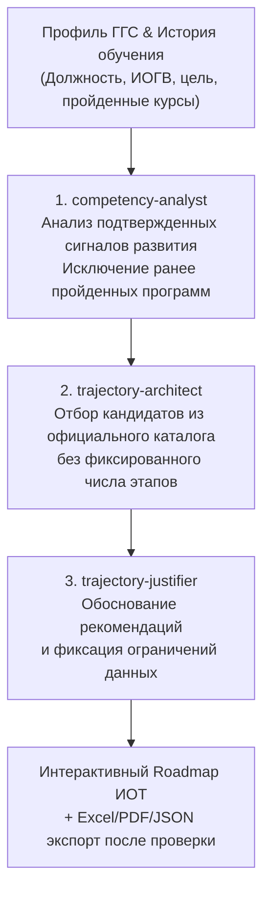

# ИИ-Агент Индивидуальной Траектории Обучения (ИОТ)
### Корпоративный университет Санкт-Петербурга

Интеллектуальная мультиагентная система для проектирования персонализированных образовательных траекторий государственных гражданских служащих (ГГС) Санкт-Петербурга. Система анализирует профиль служащего, специфику ведомства (ИОГВ), историю ранее пройденных программ и формирует пошаговую траекторию на основе каталога 2025 года. Когортный бенчмарк используется только при наличии подходящей группы в исходных данных.

---

## Контролируемый запуск для экспертов и судей

Проект упакован в Docker-контейнеры. Для генерации необходимо настроить ключ выбранного облачного провайдера либо установить локальный GGUF-файл согласно `ADMIN_GUIDE.md`.

### Linux / macOS
```bash
git clone https://github.com/sqtwix/ai-education-mentor.git
cd ai-education-mentor
chmod +x deploy.sh
./deploy.sh
```

При первом запуске скрипт создаёт `.env` с криптографически случайными `DB_PASSWORD` и `JWT_SECRET` и правами `600`. Для запуска интерфейса на другом порту используйте, например, `FRONTEND_PORT=8088 ./deploy.sh`. Ключи LLM, checksum локальной модели и `MIN_COHORT_SIZE` автоматически не подставляются.

### Windows (PowerShell / CMD)
```cmd
git clone https://github.com/sqtwix/ai-education-mentor.git
cd ai-education-mentor
deploy.bat
```

При первом запуске `deploy.bat` создаёт `.env` со случайными `DB_PASSWORD` и `JWT_SECRET`. Остальные значения, требующие решения владельца системы, остаются пустыми.

После запуска откройте веб-интерфейс в браузере:
**[http://localhost/](http://localhost/)** (или `http://localhost:5173` в режиме разработки)

* **Веб-интерфейс**: `http://localhost/`
* **Swagger API (Бэкенд api-core)**: `http://127.0.0.1:5050/swagger`
* **FastAPI Docs (ИИ-драйвер)**: `http://localhost:8000/docs`

---

## Пакет документации проекта

- **[agent.md](agent.md)**: Полная архитектурная спецификация ИИ-агента, правила когортного матчинга и системные требования.
- **[USER_GUIDE.md](USER_GUIDE.md)**: Пошаговая инструкция пользователя (служащего и методиста КУ СПб).
- **[ADMIN_GUIDE.md](ADMIN_GUIDE.md)**: Руководство администратора по развертыванию, мониторингу и настройке локальных GGUF-моделей.
- **[MODEL_COMPARISON.md](MODEL_COMPARISON.md)**: Методика и незаполненный шаблон сравнения 3 групп моделей; результаты требуют утвержденного экспертного test set.
- **[RELEASE_GATE.md](RELEASE_GATE.md)**: Контрольный список приемки production-демо.

---

## Системные требования

### Минимальные требования (Offline Local CPU / Cloud API):
* **Процессор**: 4 ядра x86_64 / ARM64
* **Оперативная память (RAM)**: 4–8 ГБ
* **Свободный диск**: 10 ГБ SSD
* **ПО**: Docker / Docker Desktop

### Рекомендуемые требования (Для локальной инференс-модели Qwen):
* **Процессор**: 8 ядер CPU или видеокарта с **4–8 ГБ VRAM** (NVIDIA CUDA / Apple Silicon Metal)
* **Оперативная память (RAM)**: 16 ГБ
* **Свободный диск**: 20 ГБ SSD

---

## Архитектура конвейера ИИ-агентов

Система использует мультиагентный конвейер из 3 специализированных ролей:



### Поддержка 3 провайдеров LLM:
1. **Зарубежные модели**: модель DeepSeek, заданная в `DEEPSEEK_MODEL` (`deepseek-chat` по умолчанию), через облачный API.
2. **Отечественные модели**: модель Sber GigaChat, заданная в `SBERGPT_MODEL` (`GigaChat-Pro` по умолчанию), через облачный API.
3. **Локальные модели**: GGUF-модель, заданная в `QWEN_MODEL_FILE`, через `llama.cpp server`; локальный файл модели в репозиторий не входит.

Рекомендуемый локальный профиль для текущего конвейера — `Qwen3-1.7B-Q4_K_M.gguf` с проверкой SHA-256, non-thinking JSON-режимом и `QWEN_PARALLEL=1`. Стойкая очередь API сериализует задания; после перезапуска AI-driver ожидает readiness модели и при транспортном обрыве повторяет только незавершённого агента один раз.

Интерфейс разрешает выбрать только фактически настроенный облачный провайдер или отвечающий локальный сервер. Идентификатор модели показывается из текущей конфигурации.

---

## Данные из предоставленных исходных файлов

Каталог и история обучения собраны из файлов, включенных в проект; отсутствующие поля не дополняются сгенерированным содержимым:

1. **Каталог 2025 года (159 программ из официальных источников)**:
   * **Программы повышения квалификации (ППК)**: 95 карточек программ со страниц 11–87 официального 89-страничного буклета «Линейка программ на 2025 год»; названия, аннотации и трудоемкость извлечены без генерации недостающего текста.
   * **Электронные курсы (ЭК)**: 64 курса из реестра электронных курсов с аннотациями, целями и результатами ZUV (*«знать, уметь, владеть»*).
   * Если исходный реестр не содержит трудоемкость или формализованную категорию компетенции, интерфейс показывает отсутствие данных и не подставляет значение по умолчанию.
2. **История обучения (1 314 записей)**:
   * 323 профиля по **36 должностям** (*Главный специалист, Ведущий специалист, Начальник отдела, Заместитель главы администрации и др.*) в 60 ИОГВ.
   * Рассчитаны когортные бенчмарки по парам `(Должность, ИОГВ)` и общегородские срезы. Они участвуют в рекомендациях только после настройки согласованного `MIN_COHORT_SIZE`.

---

## Основные функциональные модули

### 1. Конструктор индивидуальной траектории (`#constructor`)
* **Реестр сотрудников**: доступен только роли администратора; назначение роли и регламент доступа должны быть определены владельцем системы.
* **Кастомный конструктор профиля**: ручной ввод с выпадающими списками 36 реальных должностей и ИОГВ Санкт-Петербурга.
* **Исключение дубликатов**: валидатор удаляет из рекомендаций курсы со статусом «Пройден».

### 2. Интерактивный Roadmap траектории (`#report-detail-...`)
* **Поэтапное представление**: интерфейс отображает только этапы и сроки, которые присутствуют в проверенном ответе; fallback показывает единый список кандидатов для экспертной проверки без вымышленных сроков.
* **Интерактивные карточки курсов**: бейджи формата, академические часы, приоритет и компетенции показываются только при наличии соответствующих данных.
* **Детальное модальное окно**: аннотация и учебные результаты из каталога, а также обоснование рекомендации. Ссылка на статистику коллег показывается только при наличии подходящего бенчмарка.
* **Матрица компетенций (Radar Chart)**: показывается только при наличии подтвержденных измерений текущего и целевого уровней; текущий входной контракт таких измерений не содержит, поэтому диаграмма обычно скрыта.
* **Бенчмарк по должности**: процент коллег на аналогичной позиции, успешно освоивших рекомендованные программы.

### 3. Каталог образовательных программ 2025 (`#catalog`)
* Полнотекстовый поиск по полному каталогу курсов.
* Фильтрация по формату (ППК / ЭК) и подтвержденным категориям компетенций.
* Просмотр официальных аннотаций и учебных результатов.

### 4. Аналитика и бенчмаркинг по должностям (`#analytics`)
* Интерактивная статистика на основе 1 314 записей обучения.
* Топ-10 востребованных курсов для выбранной должности.
* Распределение успешности прохождения программ (доля сдачи с первого раза).

### 5. Экспорт отчетов
* **Excel (.xlsx)**: книга с индивидуальным планом; листы матрицы компетенций и бенчмарка заполняются только при наличии подтвержденных данных.
* **PDF**: официальный отчет с таблицами, результатами ZUV и методическим заключением.
* **JSON**: открытый машиночитаемый формат для интеграции с внешними LMS / HR-системами.

---

## Безопасность и защита персональных данных

1. **Автоматическое обезличивание (PII Masking)**: парсер [FileParser.cs](api-core/ApiCore/ApiCore/Services/FileParser.cs) содержит регулярные выражения для маскирования персональных данных:
   - Email-адреса → `user_***@***`
   - Номера телефонов → `+7 (***) ***-**-**`
   - Номера СНИЛС → `***-***-*** **`
   - Паспортные данные → `**** ******`
2. **Анонимизация перед LLM**: при вызове облачных провайдеров ФИО заменяется на `ГГС_ID_{hash}`. Настоящее ФИО восстанавливается локально на этапе формирования финального ответа.
3. **Конфиденциальность при локальном запуске**: в режиме `Qwen Local (llama.cpp)` данные не передаются во внешнюю сеть и обрабатываются строго на сервере заказчика.
4. **Защита загрузки**: не более 25 МБ на файл, 50 МБ суммарно и 20 файлов; ZIP/XLSX проверяются на чрезмерный распакованный объём, число entries и небезопасную степень сжатия. Значения можно изменить через `UPLOAD_MAX_*`.
5. **Стойкая обработка**: пакетные задачи сохраняют checkpoint после каждого профиля и после перезапуска продолжают с незавершённой части.
6. **Проверяемость рекомендаций**: курс принимается только из официального каталога и при подтверждённой связи с явной целью или доступным когортным срезом. Неподтверждённые сроки, приоритеты и уровни компетенций отклоняются.

Подробное сопоставление production-мер с похожим проектом приведено в [PRODUCTION_HARDENING_AUDIT.md](PRODUCTION_HARDENING_AUDIT.md).

---

## Структура репозитория

```
ai-education-mentor/
├── ai-driver/               # Микросервис ИИ-агентов (Python / FastAPI)
│   ├── backend/             # Multi-Agent Pipeline (Competency Analyst, Architect, Justifier)
│   │   ├── data/            # Каталог 2025 и бенчмарки 1 314 записей
│   │   ├── agent_factory.py # Фабрика LLM (DeepSeek, Sber GigaChat, Local Qwen)
│   │   └── agent_manager.py # Логика фильтрации дубликатов и обогащения метаданными
│   └── schemas/             # Pydantic-контракты запросов и ответов
├── api-core/                # Основной бэкенд (ASP.NET Core 9 / C#)
│   └── ApiCore/
│       ├── Controllers/     # REST API (Генерация ИОТ, каталог, пользователи, бенчмарки)
│       ├── Services/        # Стойкая PostgreSQL-очередь задач и FileParser с PII-очисткой
│       └── Models/          # DTO структуры ИОТ и этапов обучения
├── frontend/                # Пользовательский интерфейс (React 19, Vite, Recharts, ExcelJS)
│   └── src/
│       ├── components/      # TrajectoryRoadmap, TrajectoryConstructor, CatalogExplorer, ColleagueAnalytics
│       ├── reportExport.js  # Генерация Excel (3 листа), PDF и JSON
│       └── api.js           # Клиент API взаимодействия с бэкендом
├── example_files/           # Исходные файлы заказчика (Реестр ЭК, Буклет 2025, История обучения)
├── task_doc/                # Документация и распаковка технического задания Кейса 3
├── agent.md                 # Полная спецификация и системные правила ИИ-агента
├── USER_GUIDE.md            # Инструкция пользователя платформы
├── ADMIN_GUIDE.md           # Инструкция администратора по развертыванию
├── MODEL_COMPARISON.md      # Методика и незаполненный шаблон сравнения моделей
├── RELEASE_GATE.md          # Контрольный список приемки production-демо
├── docker-compose.yml       # Спецификация запуска контейнеров
├── deploy.sh / deploy.bat   # Скрипты развертывания в 1 клик
└── README.md                # Документация проекта
```

---

## Разработчики

Разработано для финала хакатона **Корпоративного университета Санкт-Петербурга**.
Все права защищены © 2025.
