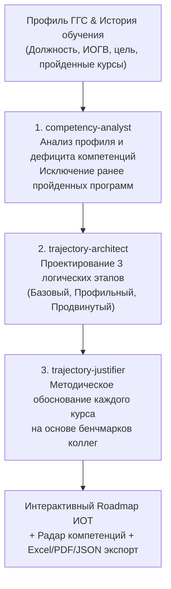

# ИИ-Агент Индивидуальной Траектории Обучения (ИОТ)
### Корпоративный университет Санкт-Петербурга

Интеллектуальная мультиагентная система для автоматического проектирования персонализированных образовательных траекторий государственных гражданских служащих (ГГС) Санкт-Петербурга. Система анализирует профиль служащего, специфику ведомства (ИОГВ), историю ранее пройденных программ и формирует доказательную пошаговую траекторию обучения на основе официального каталога 2025 года и бенчмарков коллег.

---

## Быстрый запуск для экспертов и судей (1 команда)

Проект полностью упакован в Docker-контейнеры и готов к автономному развертыванию.

### Linux / macOS
```bash
git clone https://github.com/sqtwix/ai-education-mentor.git
cd ai-education-mentor
chmod +x deploy.sh
./deploy.sh
```

### Windows (PowerShell / CMD)
```cmd
git clone https://github.com/sqtwix/ai-education-mentor.git
cd ai-education-mentor
deploy.bat
```

После запуска откройте веб-интерфейс в браузере:
**[http://localhost/](http://localhost/)** (или `http://localhost:5173` в режиме разработки)

* **Веб-интерфейс**: `http://localhost/`
* **Swagger API (Бэкенд api-core)**: `http://localhost:5000/swagger`
* **FastAPI Docs (ИИ-драйвер)**: `http://localhost:8000/docs`

---

## Системные требования

### Минимальные требования (Offline Local CPU / Cloud API):
* **Процессор**: 4 ядра x86_64 / ARM64
* **Оперативная память (RAM)**: 4–8 ГБ
* **Свободный диск**: 10 ГБ SSD
* **ПО**: Docker / Docker Desktop

### Рекомендуемые требования (Для локальной инференс-модели Qwen):
* **Процессор**: 8 ядер CPU или видеокарта с **4–8 ГБ VRAM** (NVIDIA CUDA / Apple Silicon Metal)
* **Оперативная память (RAM)**: 16 ГБ
* **Свободный диск**: 20 ГБ SSD

---

## Архитектура конвейера ИИ-агентов

Система использует мультиагентный конвейер из 3 специализированных ролей:



### Поддержка 3 провайдеров LLM:
1. **Зарубежные модели**: DeepSeek V3 / R1 (высокая точность структурирования и синтеза).
2. **Отечественные модели**: Sber GigaChat Pro / SberGPT (стандарты государственного управления РФ).
3. **100% Локальные автономные модели (Air-Gapped)**: Qwen 2.5 (GGUF) через `llama.cpp server` без выхода в интернет.

---

## Реальные данные в системе (Без моков и фейков)

Система работает исключительно на реальных данных Корпоративного университета Санкт-Петербурга:

1. **Каталог 2025 года (221 программа)**:
   * **Программы повышения квалификации (ППК)**: распарсены все 89 страниц официального буклета «Линейка программ на 2025 год».
   * **Электронные курсы (ЭК)**: 64 курса из реестра электронных курсов с аннотациями, целями и результатами ZUV (*«знать, уметь, владеть»*).
2. **Реальная база обучения (1315 записей)**:
   * 323 реальных служащих Санкт-Петербурга по **36 должностям** (*Главный специалист, Ведущий специалист, Начальник отдела, Заместитель главы администрации и др.*).
   * Рассчитаны бенчмарки популярности и успешности сдачи программ коллегами аналогичных должностей.

---

## Основные функциональные модули

### 1. Конструктор индивидуальной траектории (`#constructor`)
* **Быстрый выбор сотрудника**: выбор любого из 323 реальных служащих из реестра с автоматическим заполнением должности, ведомства и истории обучения.
* **Кастомный конструктор профиля**: ручной ввод с выпадающими списками 36 реальных должностей и ИОГВ Санкт-Петербурга.
* **Динамическое исключение дубликатов**: курсы со статусом «Пройден» гарантированно исключаются из рекомендаций.

### 2. Интерактивный Roadmap траектории (`#report-detail-...`)
* **Поэтапное представление**: Этап 1 (Базовый), Этап 2 (Профильный), Этап 3 (Продвинутый) с указанием рекомендованных сроков.
* **Интерактивные карточки курсов**: бейджи формата (ППК / ЭК), академические часы (16, 24, 36, 40, 72 ч.), приоритет, развиваемые компетенции.
* **Детальное модальное окно**: полный текст аннотации, целевые результаты обучения (*знать, уметь, владеть*) и **доказательное обоснование от ИИ** со ссылкой на специфику должности и статистику коллег.
* **Матрица компетенций (Radar Chart)**: интерактивная лепестковая диаграмма с динамикой роста навыков (текущий уровень vs целевой уровень).
* **Бенчмарк по должности**: процент коллег на аналогичной позиции, успешно освоивших рекомендованные программы.

### 3. Каталог образовательных программ 2025 (`#catalog`)
* Полнотекстовый поиск по 221 курсу.
* Фильтрация по формату (ППК / ЭК), длительности и формируемым компетенциям.
* Просмотр официальных аннотаций и учебных результатов.

### 4. Аналитика и бенчмаркинг по должностям (`#analytics`)
* Интерактивная статистика на основе 1315 записей обучения.
* Топ-10 востребованных курсов для выбранной должности.
* Распределение успешности прохождения программ (доля сдачи с первого раза).

### 5. Экспорт отчетов
* **Excel (.xlsx)**: профессиональная 3-страничная книга (Лист 1: *Индивидуальный план ИОТ*, Лист 2: *Матрица компетенций*, Лист 3: *Бенчмарк по должности*).
* **PDF**: официальный отчет с таблицами, результатами ZUV и методическим заключением.
* **JSON**: открытый машиночитаемый формат для интеграции с внешними LMS / HR-системами.

---

## Безопасность и защита персональных данных

1. **Автоматическое обезличивание (PII Masking)**: парсер [FileParser.cs](file:///c:/Users/ivan2/ai-education-mentor/api-core/ApiCore/ApiCore/Services/FileParser.cs) при загрузке и обработке данных маскирует персональные данные регулярными выражениями:
   - Email-адреса → `user_***@***`
   - Номера телефонов → `+7 (***) ***-**-**`
   - Номера СНИЛС → `***-***-*** **`
   - Паспортные данные → `**** ******`
2. **Конфиденциальность при локальном запуске**: в режиме `Qwen Local (llama.cpp)` данные не передаются во внешнюю сеть и обрабатываются строго на сервере заказчика.

---

## Структура репозитория

```
ai-education-mentor/
├── ai-driver/               # Микросервис ИИ-агентов (Python / FastAPI)
│   ├── backend/             # Multi-Agent Pipeline (Competency Analyst, Architect, Justifier)
│   │   ├── data/            # 221 курс каталога 2025 и бенчмарки 1315 записей
│   │   ├── agent_factory.py # Фабрика LLM (DeepSeek, Sber GigaChat, Local Qwen)
│   │   └── agent_manager.py # Логика фильтрации дубликатов и обогащения метаданными
│   └── schemas/             # Pydantic-контракты запросов и ответов
├── api-core/                # Основной бэкенд (ASP.NET Core 9 / C#)
│   └── ApiCore/
│       ├── Controllers/     # REST API (Генерация ИОТ, каталог, пользователи, бенчмарки)
│       ├── Services/        # Асинхронный оркестратор задач и FileParser с PII-очисткой
│       └── Models/          # DTO структуры ИОТ и этапов обучения
├── frontend/                # Пользовательский интерфейс (React 19, Vite, Recharts, ExcelJS)
│   └── src/
│       ├── components/      # TrajectoryRoadmap, TrajectoryConstructor, CatalogExplorer, ColleagueAnalytics
│       ├── reportExport.js  # Генерация Excel (3 листа), PDF и JSON
│       └── api.js           # Клиент API взаимодействия с бэкендом
├── example_files/           # Исходные файлы заказчика (Реестр ЭК, Буклет 2025, История обучения)
├── task_doc/                # Документация и распаковка технического задания Кейса 3
├── agent.md                 # Полная спецификация и системные правила ИИ-агента
├── docker-compose.yml       # Спецификация запуска контейнеров
├── deploy.sh / deploy.bat   # Скрипты развертывания в 1 клик
└── README.md                # Документация проекта
```

---

## Разработчики

Разработано для финала хакатона **Корпоративного университета Санкт-Петербурга**.
Все права защищены © 2025.
